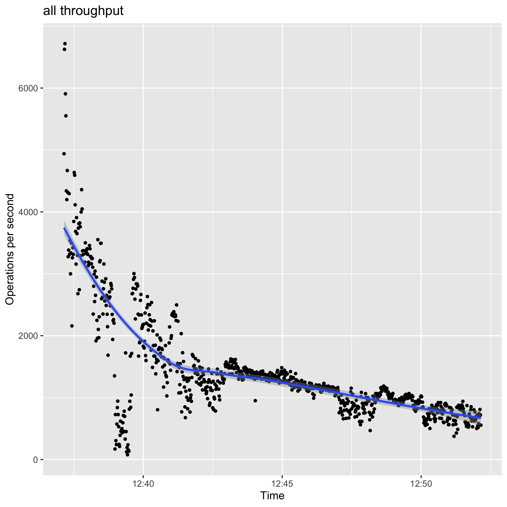
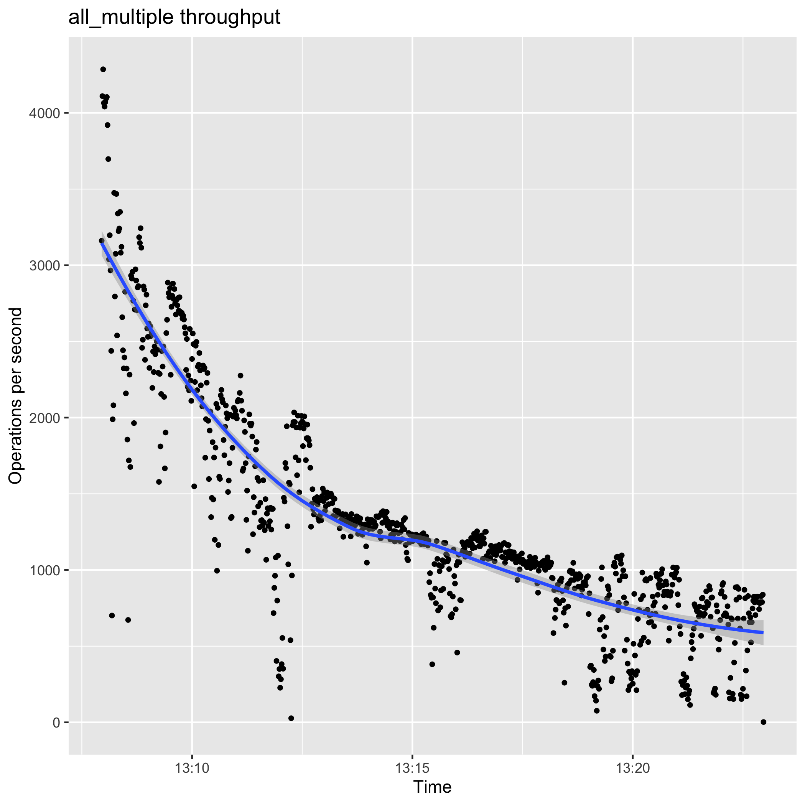

# How to benchmark riak_core_lite application?

## How to configure rcl_bench?

rcl_bench is a benchmarking tools for key-value store application.
It is a lighter verison of basho_bench and it is easy to use.

To use it, first clone the rcl_bench repository.

```sh
git clone git@github.com:riak-core-lite/rcl_bench.git
```

- Configure rcl_bench

To configure rcl_bench, you need to modify the following in rcl_bench repo.

```sh
config/sys.config
config/vm.args
```

The `sys.config` for benchmarking `rclref ` was below.

```
{rcl_bench, [
    %% Mode of load generation:
    %% max - Generate as many requests as possible per worker
    %% {rate, Rate} - Exp. distributed Mean reqs/sec
    %% {rate, max}  - as fast as possible
    {mode, {rate, max}},

    %% Base test output directory
    {test_dir, "tests"},

    %% Test duration (minutes)
    {duration, 15},

    %% Number of concurrent workers
    {concurrent, 4},

    %% Operations (and associated mix)
    {operations, [{get_own_puts, 3}, 
                  {put, 10}, 
                  {get, 2}]},

    %% Key generators
    %% {uniform_int, N} - Choose a uniformly distributed integer between 0 and N
    {key_generator, {uniform_int, 100000}},

    %% Value generators
    %% {fixed_bin, N} - Fixed size binary blob of N bytes
    {value_generator, {fixed_bin, 100}},

    {random_algorithm, exsss},
    {random_seed, {1,4,3}},

    {ip, '127.0.0.1'},
    {port, 8080}
  ]}
```

The important part in the snippet above is the operations tuple.

```
    %% Operations (and associated mix)
    {operations, [{get_own_puts, 3}, 
                  {put, 10}, 
                  {get, 2}]},

```

Associated mix is the weight of the operations. This means that on average, it will execute `get_own_puts` 3/15, `put` 10/15, `get` 2/15. The contents of the operations are implemented in the `rcl_bench_dirver.erl` module.

- Implement more operations in rcl_bench_dirver.erl

If new operations are added and you want to benchmark them, you need to add it in the `sys.config` as well.
For testing rclref, the following operations are implemented.

`get_own_puts`: get a stored value  
`get`: get a value  
`put`: put a value  

- Run the benchmark after starting the database application.

Start rclref and then run the follwoing in rcl_bench repository.

```sh
make run
```


## Where to find the results?

The results of the benchmark are stored as csv in  `rcl_bench/_build/default/rel/rcl_bench/tests`. The current results can be found in the `current` directory as well. Run the R script in the `R` directory to visualize the results by reading the csvs in the `current` directory.

```sh
Rscript latency.R TITILE_OF_CSV
Rscript throughput.R TITLE_OF_CSV
```

To see the results of all the operations, concatenate the result csvs in the `current` directory.

```sh
cat get_single.csv get-own-puts_single.csv put_single.csv | sed '2, $s/timestamp, unit, microseconds//g' >> all_single.csv
```

Then you can visualize by the following commnand in the `R` directory.

```sh
Rscript throughput.R all_single
Rscript latency.R all_single
```

This will create png file of the result.

## Results of benchmarking rcl_bench

The results of benchmarking rclref were the follwoing.


###  Environment


| Processor Name        | Dual-Core Intel Core i5 |
|-----------------------|-------------------------|
| Processor Speed       | 2 GHz                   |
| Number of Processors  | 1                       |
| Total Number of Cores | 2                       |
| L2 Cache (per Core)   | 256 KB                  |
| L3 Cache              | 4 MB                    |
| Memory                | 8 GB                    |


###  Single node

A single node cluster with N=3, R=1, W=1 using ETS as backend.

 
 


### Multi node

3 node cluster with N=3, R=1, W=1 using ETS as backend.


 

